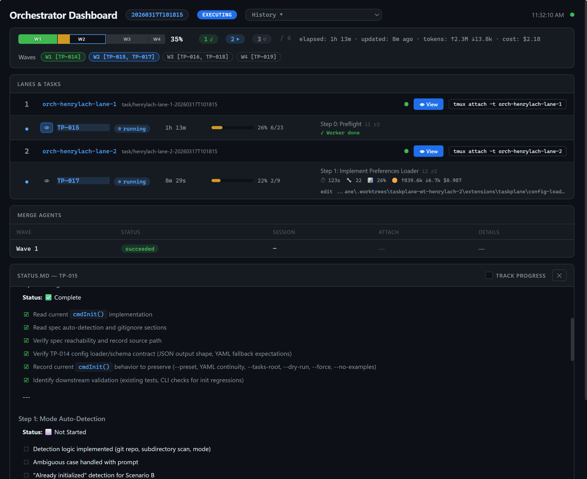

# Taskplane

Multi-agent AI orchestration for [pi](https://github.com/badlogic/pi-mono) — parallel task execution with checkpoint discipline, fresh-context worker loops, cross-model reviews, and automated merges.

> **Status:** Experimental / Early — APIs and config formats may change between releases.

## What It Does - 

## Author's Note

Just like Pi simplifies the coding-agent harness, Taskplane simplifies the agent-orchestration process for generating high-quality code at scale. I designed Taskplane after generating over 700,000 lines of code without good orchestration. I mostly used Amp and a customized Ralph Wiggum loop. Lots of lessons learned. I tended to not use Claude Code very much because it doesn't handle multi-model support easily, which you see below is critical for driving good outcomes.

Along the way, I zeroed in on prompting techniques that gave me increasingly good results. That eventually led me to create a skill that I used every time I created tasks. That was my first level-up in the quality of code I was generating (unlock #1). Unlock #2 was integrating cross-model reviews into each step in a task. And not just code reviews, but pre-implementation plan reviews as well.

My typical task consists of 5-8 steps and each step has 5-10 checkbox items that I expect the agent to implement. At the beginning of each step, I have the worker agent (Opus 4.6) plan out a course of action for the step, then send it to GPT 5.3 Codex for a plan review. That feedback gets incorporated into the plan and Opus writes the code for that step. Then it sends it back to GPT 5.3 Codex for a code review/revision process and potentially another review/update cycle if needed. Then on to the next step. Do I burn more tokens doing this? Absolutely. But it has been the single biggest unlock for generating high-quality code. And if you don't know this already, the number one time-sink in generating code is evaluating that generated code. So minimizing bugs during code generation is my highest priority.

When I discovered Pi (thank you Mario) and realized it was extensible, I immediately began developing Taskplane with the goal of creating a coding-agent orchestration system that incorporated everything I learned using Amp and Wiggum, but with the ability to run large batches of tasks, with proper dependency-graphed parallelization, proper git worktree isolation, and support for large existing brownfield polyrepo projects. My day job is managing a SaaS company with 7 developers and an 8-year-old codebase with 26 repos! Not your run-of-the-mill simple greenfield project.

I also wanted to implement Taskplane with as much deterministic code as possible and minimize the number of agent types in the system. This is because agents do the wrong thing all the time for no reason whatsoever! So the more agents you deploy, the more that will go wrong, period. If you don't believe me, you haven't generated enough code. So Taskplane has four agent types: a supervisor to supervise, workers to write code, reviewers to review plans and code, and mergers to merge. That's it for the AI agent layer. But there's an entire deterministic engine that ties those agents together in ways that keep them focused and accountable.

I also wanted visibility into the process in an easily consumable way, which for me means NOT relying on a terminal-based dashboard. There's simply no way to make terminal output look great. Taskplane has a web-based dashboard that runs locally on your computer that provides an elegant view into exactly what's going on with a running batch. You see the breakdown of waves, lanes, and tasks. You see tool, context, and cost telemetry. You can click on an icon for a task to view its STATUS.md file and watch the worker check off task items as it progresses. You see real progress. I still use the terminal to work with Taskplane to kick off batches and to interact with the supervisor agent when I need to. But in general, I launch a batch of tasks, then just look at the dashboard from time to time to see how everything is progressing. Or I just go to bed.

I wanted the system to be as autonomous as possible. To do that I needed to create the means for worker and merger agents to communicate with the supervisor, and vice versa. So I added a simple but effective file-based mail system. And it works great. Either party can initiate, and the other party replies at the next turn because every agent checks their mailbox at every turn. I went with a file-based system because these messages don't need to last forever. They get deleted when the batch is completed. And I didn't want the dependency weight of a database. Taskplane has only three dependencies: Pi, Node, and Git.


### STEP 1: Create the tasks
Taskplane turns your coding project into an AI-managed task orchestration system. You simply ask your agent to create tasks using the built-in "create-taskplane-tasks" skill. This skill provides an opinionated task definition template designed to drive successful coding outcomes. Tasks define both the prompt.md and the status.md files that together act as the persistent memory store that allows AI coding agents to survive context resets and succeed with very long running tasks that would typically exhaust an agent's context window.

### STEP 2: Run batches of tasks
Taskplane works out the dependency map for an entire batch of tasks then orchestrates them in waves, lanes, and tasks with appropriate parallelization and serialization. Taskplane can do this for both monorepo and polyrepo projects. For polyrepo projects, Taskplane additionally subdivides tasks into repo-aligned segments and uses a segmentation dependency map (DAG) to manage proper repo/worktree isolation and allow for dynamic segment expansion so worker agents can ask the supervisor agent to add additional segments to the dependency map in real time if required.

The taskplane dashboard runs on a local port on your system and gives you elegant visibility into everything that's going on (a stark improvement over TUI-based dashboards).



### Key Features

- **Task Orchestrator** — Parallel multi-task execution using git worktrees for full filesystem isolation. Dependency-aware wave scheduling. Automated merges into a dedicated orch branch — your working branch stays stable until you choose to integrate.
- **Persistent Worker Context** — Workers handle all steps in a single context, auto-detecting the model's context window (1M for Claude 4.6 Opus, 200K for Bedrock). Only iterates on context overflow. Dramatic reduction in spawn count and token cost.
- **Worker-Driven Inline Reviews** — Workers invoke a `review_step` tool at step boundaries. Reviewer agents spawn with full telemetry. REVISE feedback is addressed inline without losing context.
- **Supervisor Agent** — Conversational supervisor monitors batch progress, handles failures, and can invoke orchestrator commands autonomously (resume, integrate, pause, abort).
- **Web Dashboard** — Live browser-based monitoring via `taskplane dashboard`. SSE streaming, lane/task progress, reviewer activity, merge telemetry, batch history.
- **Structured Tasks** — PROMPT.md defines the mission, steps, and constraints. STATUS.md tracks progress. Agents follow the plan, not vibes.
- **Checkpoint Discipline** — Step boundary commits ensure work is never lost, even if a worker crashes mid-task.
- **Cross-Model Review** — Reviewer agent uses a different model than the worker agent (highly recommended, not enforced). Independent quality gate before merge.

## Installation

Taskplane is a pi package. You need [Node.js](https://nodejs.org/) ≥ 22, [pi](https://github.com/badlogic/pi-mono) and Git installed first.

### Prerequisites

| Dependency | Required | Notes |
|-----------|----------|-------|
| [Node.js](https://nodejs.org/) ≥ 22 | Yes | Runtime |
| [pi](https://github.com/badlogic/pi-mono) | Yes | Agent framework |
| [Git](https://git-scm.com/) | Yes | Version control, worktrees |

### Option A: Global Install (all projects - recommended)

```bash
pi install npm:taskplane
```

### Option B: Single Project-Local Install

```bash
cd my-project
pi install -l npm:taskplane
```

### Scaffold your project

You'll need to initialize taskplane for each project you use it in to scaffold some settings.

```bash
taskplane init
```

Verify the installation and scaffolding. You should have all green checkboxes if everything was successful:

```bash
taskplane doctor
```

## Quickstart

### 1. Initialize a project

```bash
cd my-project
taskplane init --preset full
```

This creates config files in `.pi/`, agent prompts, two example tasks, and adds `.gitignore` entries for runtime artifacts. On first install, init bootstraps global preferences at `~/.pi/agent/taskplane/preferences.json` with thinking defaults set to `high` for worker/reviewer/merger. Interactive init then prompts for worker/reviewer/merger model + thinking defaults (`inherit`, `off`, `minimal`, `low`, `medium`, `high`, `xhigh`). If 2+ providers are available from `pi --list-models`, init recommends cross-provider reviewer/merger selections. Init auto-detects whether you're in a single repo or a multi-repo workspace. See the [install tutorial](docs/tutorials/install.md) for workspace mode and other scenarios.

Want to reuse model/thinking picks across projects? Run `taskplane config --save-as-defaults` in an initialized project.

Already have a task folder (for example `docs/task-management`)? Use:

```bash
taskplane init --preset full --tasks-root docs/task-management
```

When `--tasks-root` is provided, example task packets are skipped by default. Add `--include-examples` if you explicitly want examples in that folder.

### 2. Launch the dashboard (recommended)

In a separate terminal:

```bash
taskplane dashboard
```

Opens a live web dashboard at `http://localhost:8099` with real-time batch monitoring.

### 3. Run your first orchestration

```bash
pi
```

Inside the pi session:

```
/orch               # Detect project state — guides onboarding or offers to start a batch
/orch-plan all      # Preview waves, lanes, and dependencies
/orch all           # Execute all pending tasks in parallel
/orch-status        # Monitor batch progress
```

`/orch` with no arguments is the universal entry point — it detects your project state and activates the supervisor for guided interaction (onboarding, batch planning, health checks, or retrospective). The default scaffold includes two independent example tasks, so `/orch all` gives you an immediate orchestrator + dashboard experience.

### 4. Run a single task with isolation

For a single task with full worktree isolation, dashboard, and reviews:

```text
/orch taskplane-tasks/EXAMPLE-001-hello-world/PROMPT.md
```

This uses the same orchestrator infrastructure as a full batch — isolated worktree, orch branch, supervisor, dashboard, inline reviews — but for just one task.

## Commands

### Pi Session Commands

| Command | Description |
|---------|-------------|
| `/orch [<areas\|paths\|all>]` | No args: detect state & guide (onboarding, batch planning, etc.); with args: execute tasks via isolated worktrees |
| `/orch-plan <areas\|paths\|all>` | Preview execution plan without running |
| `/orch-status` | Show batch progress |
| `/orch-pause` | Pause batch after current tasks finish |
| `/orch-resume [--force]` | Resume a paused batch (or force-resume from stopped/failed) |
| `/orch-abort [--hard]` | Abort batch (graceful or immediate) |
| `/orch-deps <areas\|paths\|all>` | Show dependency graph |
| `/orch-sessions` | List active worker sessions |
| `/orch-integrate` | Integrate completed orch batch into your working branch |
| `/taskplane-settings` | View and edit taskplane configuration interactively |

### CLI Commands

| Command | Description |
|---------|-------------|
| `taskplane init` | Scaffold project config (interactive or `--preset`) |
| `taskplane doctor` | Validate installation and config |
| `taskplane config --save-as-defaults` | Save current worker/reviewer/merger model + thinking settings as defaults for future `taskplane init` runs |
| `taskplane version` | Show version info |
| `taskplane dashboard` | Launch the web dashboard |
| `taskplane uninstall` | Remove Taskplane project files and optionally uninstall package (`--package`) |

## How It Works

```
┌─────────────────────────────────────────────────────────────┐
│                    ORCHESTRATOR (/orch)                      │
│  Parse tasks → Build dependency DAG → Compute waves         │
│  Assign lanes → Spawn workers → Monitor → Merge             │
└──────┬──────────┬──────────┬────────────────────────────────┘
       │          │          │
  ┌────▼────┐ ┌──▼─────┐ ┌──▼─────┐
  │ Lane 1  │ │ Lane 2 │ │ Lane 3 │    ← Git worktrees
  │ Worker  │ │ Worker │ │ Worker │       (isolated)
  │ Review  │ │ Review │ │ Review │
  └────┬────┘ └──┬─────┘ └──┬─────┘
       │         │          │
       └─────────┼──────────┘
                 │
          ┌──────▼──────┐
          │ Merge Agent │    ← Conflict resolution
          │ Orch Branch │      & verification
          └──────┬──────┘
                 │
          ┌──────▼──────┐
          │ /orch-      │    ← User integrates into
          │  integrate  │      working branch
          └─────────────┘
```

**How it works:** Tasks are sorted into dependency waves. Each wave runs in parallel across lanes (git worktrees). Workers handle all steps in a single context, calling `review_step` at step boundaries for inline reviews. Completed lanes merge into a dedicated orch branch. A supervisor agent monitors progress and can autonomously resume, integrate, or abort. When the batch completes, use `/orch-integrate` to bring the results into your working branch (or configure auto-integration).

## Documentation

📖 **[Full Documentation](docs/README.md)**

Start at the docs index for tutorials, how-to guides, reference docs, and architecture explanations.

## Contributing

See **[CONTRIBUTING.md](CONTRIBUTING.md)** for development setup, testing, and contribution guidelines.

Maintainers: GitHub governance and branch protection guidance is in [docs/maintainers/repository-governance.md](docs/maintainers/repository-governance.md).

## License

[MIT](LICENSE) © Henry Lach
